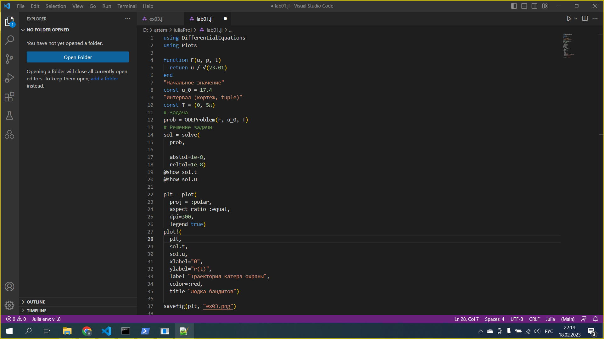

---
## Front matter
lang: ru-RU
title: Отчёт по лабораторной работе №2
author: |
	Абрамян А. А.
institute: |
	RUDN University, Moscow, Russian Federation
date: 2023, 11 февраля Москва, Россия

## Formatting
toc: false
slide_level: 2
theme: metropolis
header-includes: 
 - \metroset{progressbar=frametitle,sectionpage=progressbar,numbering=fraction}
 - '\makeatletter'
 - '\beamer@ignorenonframefalse'
 - '\makeatother'
aspectratio: 43
section-titles: true
---

## Прагматика

- выполнить математическую задачу;
- решить возникающие трудности и проблемы;
- практически получить полезный результат;

## Цель работы

- решить математическую задачу с помощью языка программирования julia

## Выполнение лабораторной работы

1. Вывели необходимые значения для решения задачи. (рис. \ref{img1})

{ width=70% }

## Выполнение лабораторной работы

2. Написали код на ЯП julia для расчёта траектории и построения графика. (рис. \ref{img2})

{ width=70% }

3. Получили траекторию движения катера охраны. (рис. \ref{img3})

{ width=70% }

## Результаты

- В данной лабораторной работе мне успешно удалось решить математическую задачу с помощью языка программирования julia.
