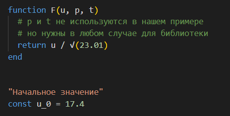

---
# Front matter
lang: ru-RU
title: "Отчёт по лабораторной работе №2"
subtitle: "дисциплина: Математическое моделирование"
author: "Абрамян Артём Арменович"

# Formatting
toc-title: "Содержание"
toc: true # Table of contents
toc_depth: 2
fontsize: 12pt
linestretch: 1.5
papersize: a4paper
documentclass: scrreprt
polyglossia-lang: russian
polyglossia-otherlangs: english
mainfont: PT Serif
romanfont: PT Serif
sansfont: PT Sans
monofont: PT Mono
mainfontoptions: Ligatures=TeX
romanfontoptions: Ligatures=TeX
sansfontoptions: Ligatures=TeX,Scale=MatchLowercase
monofontoptions: Scale=MatchLowercase
indent: true
pdf-engine: lualatex
header-includes:
  - \linepenalty=10 # the penalty added to the badness of each line within a paragraph (no associated penalty node) Increasing the value makes tex try to have fewer lines in the paragraph.
  - \interlinepenalty=0 # value of the penalty (node) added after each line of a paragraph.
  - \hyphenpenalty=50 # the penalty for line breaking at an automatically inserted hyphen
  - \exhyphenpenalty=50 # the penalty for line breaking at an explicit hyphen
  - \binoppenalty=700 # the penalty for breaking a line at a binary operator
  - \relpenalty=500 # the penalty for breaking a line at a relation
  - \clubpenalty=150 # extra penalty for breaking after first line of a paragraph
  - \widowpenalty=150 # extra penalty for breaking before last line of a paragraph
  - \displaywidowpenalty=50 # extra penalty for breaking before last line before a display math
  - \brokenpenalty=100 # extra penalty for page breaking after a hyphenated line
  - \predisplaypenalty=10000 # penalty for breaking before a display
  - \postdisplaypenalty=0 # penalty for breaking after a display
  - \floatingpenalty = 20000 # penalty for splitting an insertion (can only be split footnote in standard LaTeX)
  - \raggedbottom # or \flushbottom
  - \usepackage{float} # keep figures where there are in the text
  - \floatplacement{figure}{H} # keep figures where there are in the text
---

# Цель работы

В данной лабораторной работе мне было необходимо решить математическую задачу с помощью языка программирования julia. 

# Теория

- julia
Язык программирования Julia разрабатывается с 2009 года в Массачусетском технологическом институте (MIT). Распространяется бесплатно по лицензии MIT.
Официальный сайт проекта: https://julialang.org/.
Все исходные тексты размещены в интернете на GitHub:
https://github.com/JuliaLang/julia.
Ключевые идеи языка изложены его авторами в статьях [1, 2].
Достоинства. Наличие компилятора позволяет создавать программы, быстродействие которых сопоставимо с быстродействием программ, написанных на C, Fortran.
Исходный текст общедоступен и распространяется бесплатно. Язык кросс-платформенный. Большая часть Julia написана на Julia. Язык очень гибкий, что облегчает реализацию алгоритмов. Синтаксис Julia похож на синтаксис Matlab и Python, что облегчает перенос программ с одного языка на другой. Обеспечивается поддержка параллельных вычислений. В языке присутствуют широкие возможности метапрограммирования, благодаря чему можно написать программу, которая сгенерирует
программу, которая будет выполняться в среде Julia. Язык очень удобен для реализации численных методов с использованием готовых библиотек (линейная алгебра,
линейная и нелинейная оптимизация, с ограничениями и без них). Обеспечивается
возможность использования прикладных библиотек, созданных для Python. Наконец, язык Julia достаточно прост для изучения.
Недостатки. Язык относительно молодой, поэтому возможны изменения, число прикладных библиотек не так велико, как для Python, учебников немного, на русском
языке почти нет вообще. Время компиляции может быть ощутимым. Сторонние
прикладные библиотеки не всегда до конца отлажены. Прикладные библиотеки время от времени изменяются, и тексты программ, которые используют эти библиотеки
иногда перестают работать, поскольку, например, изменилось название одной из
функций. Ситуация с быстродействием программ на языке Julia не столь однозначна. На сайте https://docs.julialang.org/en/v1/manual/performance-tips/index.html приводится довольно большой текст, посвященный тому, как повысить эффективность
работы программы. Из текста можно понять, что быстродействие — это возможность, которой нужно еще суметь воспользоваться. 

# Задание

1. Провести аналогичные рассуждения и вывод дифференциальных уравнений,
если скорость катера больше скорости лодки в n раз (значение n задайте
самостоятельно)
2. Построить траекторию движения катера и лодки для двух случаев. (Задайте
самостоятельно начальные значения) Определить по графику точку пересечения катера и лодки.

# Выполнение лабораторной работы

1. Вывели необходимые значения для решения задачи. (рис. \ref{img1}) 

{ width=70% }

2. Написали код на ЯП julia для расчёта траектории и построения графика. (рис. \ref{img2})

{ width=70% }

3. Получили траекторию движения катера охраны. (рис. \ref{img3})

{ width=70% }

# Выводы

В данной лабораторной работе мне успешно удалось решить математическую задачу с помощью языка программирования julia.

# Библиографический список

1. Документация julia (https://julialang.org/)

