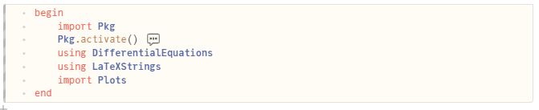
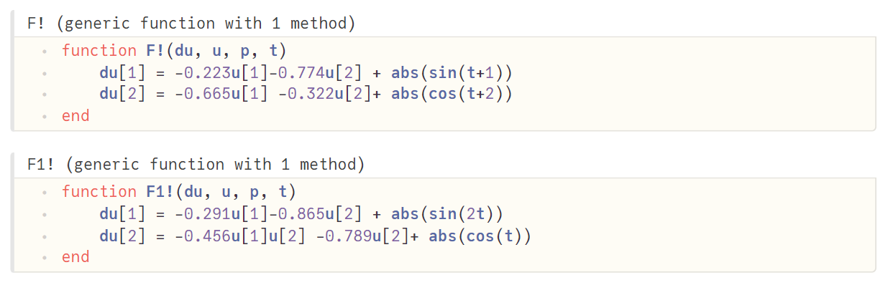
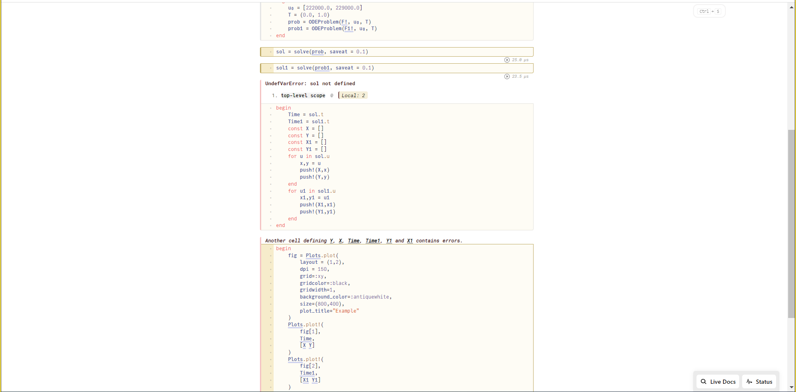
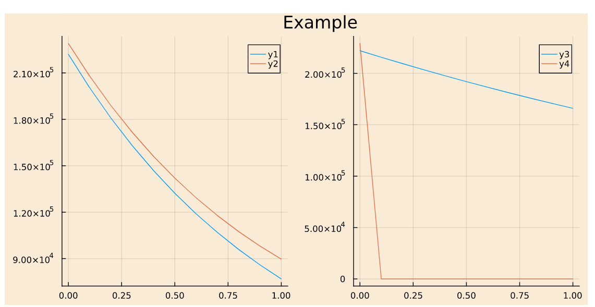

---
## Front matter
lang: ru-RU
title: Отчёт по лабораторной работе №3
author: |
	Абрамян А. А.
institute: |
	RUDN University, Moscow, Russian Federation
date: 2023, 11 февраля Москва, Россия

## Formatting
toc: false
slide_level: 2
theme: metropolis
header-includes: 
 - \metroset{progressbar=frametitle,sectionpage=progressbar,numbering=fraction}
 - '\makeatletter'
 - '\beamer@ignorenonframefalse'
 - '\makeatother'
aspectratio: 43
section-titles: true
---

## Прагматика

- решить математическую задачу;
- решить возникающие трудности и проблемы;
- практически получить полезный результат;

## Цель работы

- В данной лабораторной работе мне было необходимо решить математическую задачу про битвы между армиями двух стран.

## Выполнение лабораторной работы

1. Создали новый файл в среде разработки Pluto.jl. (рис. \ref{img1}) 

{ width=70% }

2. Импортировали необходимые модули и библиотеки. (рис. \ref{img2})

{ width=70% }

## Выполнение лабораторной работы

3. Написали функцию для каждой модели с нужными значениями из задания №52. (рис. \ref{img3})

{ width=70% }

## Выполнение лабораторной работы

4. Написали код сохранения значений для x,y; код для построения графиков. (рис. \ref{img4})

{ width=70% }

## Выполнение лабораторной работы

5. Получили графики для двух моделей. (рис. \ref{img5})

{ width=70% }

## Результаты

- В данной лабораторной работе мне успешно удалось решить математическую задачу про битвы между армиями двух стран.
