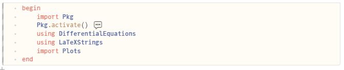
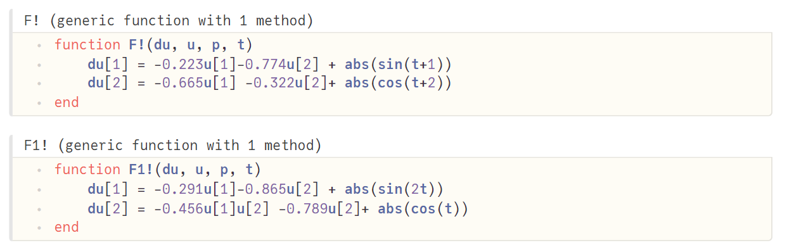
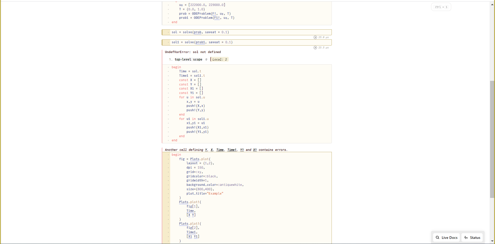
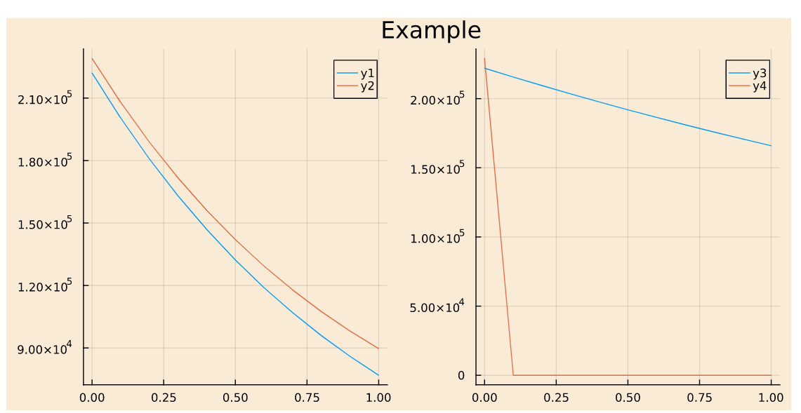

---
# Front matter
lang: ru-RU
title: "Отчёт по лабораторной работе №3"
subtitle: "дисциплина: Математическое моделирование"
author: "Абрамян Артём Арменович"

# Formatting
toc-title: "Содержание"
toc: true # Table of contents
toc_depth: 2
fontsize: 12pt
linestretch: 1.5
papersize: a4paper
documentclass: scrreprt
polyglossia-lang: russian
polyglossia-otherlangs: english
mainfont: PT Serif
romanfont: PT Serif
sansfont: PT Sans
monofont: PT Mono
mainfontoptions: Ligatures=TeX
romanfontoptions: Ligatures=TeX
sansfontoptions: Ligatures=TeX,Scale=MatchLowercase
monofontoptions: Scale=MatchLowercase
indent: true
pdf-engine: lualatex
header-includes:
  - \linepenalty=10 # the penalty added to the badness of each line within a paragraph (no associated penalty node) Increasing the value makes tex try to have fewer lines in the paragraph.
  - \interlinepenalty=0 # value of the penalty (node) added after each line of a paragraph.
  - \hyphenpenalty=50 # the penalty for line breaking at an automatically inserted hyphen
  - \exhyphenpenalty=50 # the penalty for line breaking at an explicit hyphen
  - \binoppenalty=700 # the penalty for breaking a line at a binary operator
  - \relpenalty=500 # the penalty for breaking a line at a relation
  - \clubpenalty=150 # extra penalty for breaking after first line of a paragraph
  - \widowpenalty=150 # extra penalty for breaking before last line of a paragraph
  - \displaywidowpenalty=50 # extra penalty for breaking before last line before a display math
  - \brokenpenalty=100 # extra penalty for page breaking after a hyphenated line
  - \predisplaypenalty=10000 # penalty for breaking before a display
  - \postdisplaypenalty=0 # penalty for breaking after a display
  - \floatingpenalty = 20000 # penalty for splitting an insertion (can only be split footnote in standard LaTeX)
  - \raggedbottom # or \flushbottom
  - \usepackage{float} # keep figures where there are in the text
  - \floatplacement{figure}{H} # keep figures where there are in the text
---

# Цель работы

В данной лабораторной работе мне было необходимо решить математическую задачу про битвы между армиями двух стран.

# Теория

- Условие задачи:
Между страной Х и страной У идет война. Численность состава войск исчисляется от начала войны, и являются временными функциями xt() и yt(). Для упрощения модели считаем, что коэффициенты a b c h постоянны. Также считаем Pt( )и Q t( ) непрерывные функции.

# Задание

Постройте графики изменения численности войск армии Х и армии У для следующих случаев с начальными условиями из задачи №52:
1. Модель боевых действий между регулярными войсками
2. Модель ведение боевых действий с участием регулярных войск и партизанских отрядов

# Выполнение лабораторной работы

1. Создали новый файл в среде разработки Pluto.jl. (рис. \ref{img1}) 

{ width=70% }

2. Импортировали необходимые модули и библиотеки. (рис. \ref{img2})

{ width=70% }

3. Написали функцию для каждой модели с нужными значениями из задания №52. (рис. \ref{img3})

{ width=70% }

4. Написали код сохранения значений для x,y; код для построения графиков. (рис. \ref{img4})

{ width=70% }

5. Получили графики для двух моделей. (рис. \ref{img5})

{ width=70% }

# Выводы

В данной лабораторной работе мне успешно удалось решить математическую задачу про битвы между армиями двух стран.

# Библиографический список

1. Документация Pluto (https://featured.plutojl.org/)
2. Документация Julia (https://docs.juliahub.com/CalculusWithJulia/AZHbv/0.0.13/precalc/julia_overview.html)

